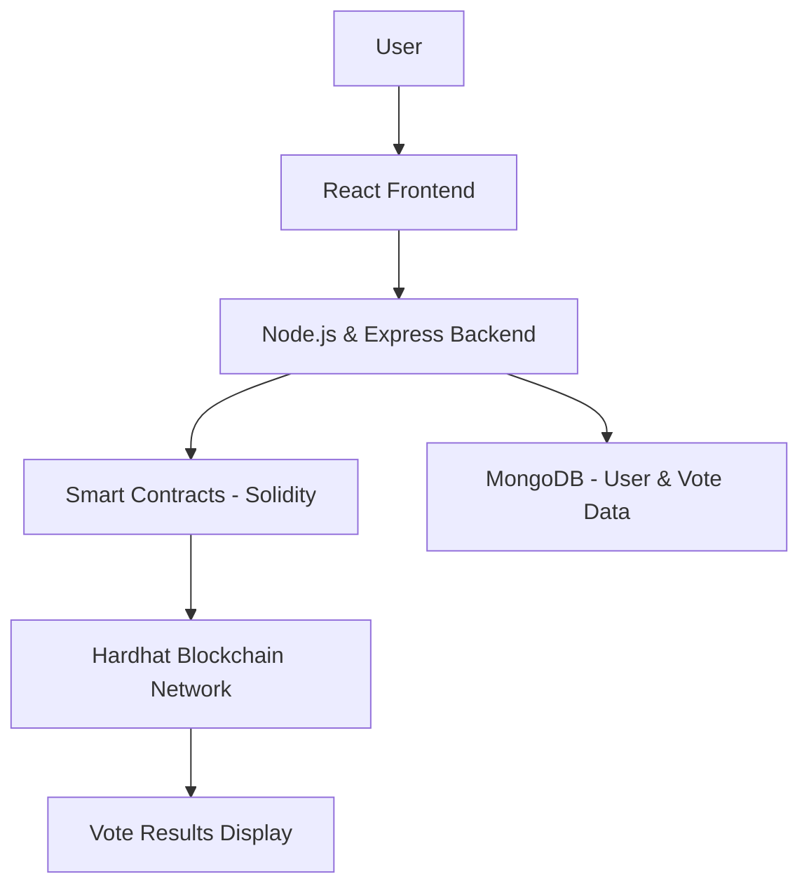

# 🗳️ ElectionX - Decentralized Voting Platform

ElectionX is a secure, transparent, and tamper-proof decentralized voting application powered by blockchain technology. It empowers users to participate in elections from anywhere, with guaranteed data integrity and anonymity.

## 📌 Key Features

* ✅ **Blockchain-Based Voting** – Immutable, transparent records for each vote.
* 🔐 **Secure Authentication** – Voter verification via secure login (email/Google).
* 🗳️ **Real-Time Election Participation** – Cast your vote instantly from any device.
* 📊 **Live Result Dashboard** – View results and participation statistics in real-time.
* 📁 **Admin Panel** – Create elections, add candidates, and monitor votes.

---

## 🛠️ Tech Stack

| Frontend | Backend             | Blockchain                   | Database |
| -------- | ------------------- | ---------------------------- | -------- |
| React.js | Node.js, Express.js | Solidity, Ethereum (Hardhat) | MongoDB  |

---

## 📷 Project Architecture



---

## ⚙️ Installation & Setup

### Prerequisites

* Node.js & npm
* Hardhat (Ethereum development environment)
* MetaMask Extension
* MongoDB

### Clone the Repository

```bash
git clone https://github.com/yourusername/ElectionX.git
cd ElectionX
```

### Install Dependencies

```bash
# For backend
cd Server
npm install

# For frontend
cd client
npm install

# For smart contracts
npm install
```

### Start the Development Server

```bash
# Start blockchain and deploy contracts using Hardhat
npx hardhat node
npx hardhat run scripts/deploy.js --network localhost

# Start backend server
cd Server
npm start

# Start frontend
cd client
npm start
```

---


## 🧹 Folder Structure

```
ElectionX/
│
├── Server/            # Express server & APIs
├── Client/           # React UI
├── contracts/    # Solidity contracts using Hardhat
└── README.md
```

---

## 🛡️ Security & Privacy

ElectionX ensures that:

* All votes are encrypted and recorded immutably.
* User identities are protected.
* Only authenticated and verified users can vote.

---

## 📈 Future Enhancements

* ✅ Mobile-friendly interface
* 🔍 Voter eligibility verification via government ID
* 🌍 Multi-election and multi-region support
* 📱 Push notifications/reminders

---

## 🤝 Contributing

Contributions, issues, and feature requests are welcome!
Feel free to fork and submit a PR.

---

## 📄 License

This project is licensed under the [MIT License](LICENSE).

---

## 💬 Connect with Me

* LinkedIn: [Adwait Tiwari](www.linkedin.com/in/adwait-tiwari-3ba40a214)
* GitHub: [@Adwait-Tiwari]([https://github.com/yourusername](https://github.com/Adwait-tiwari))
